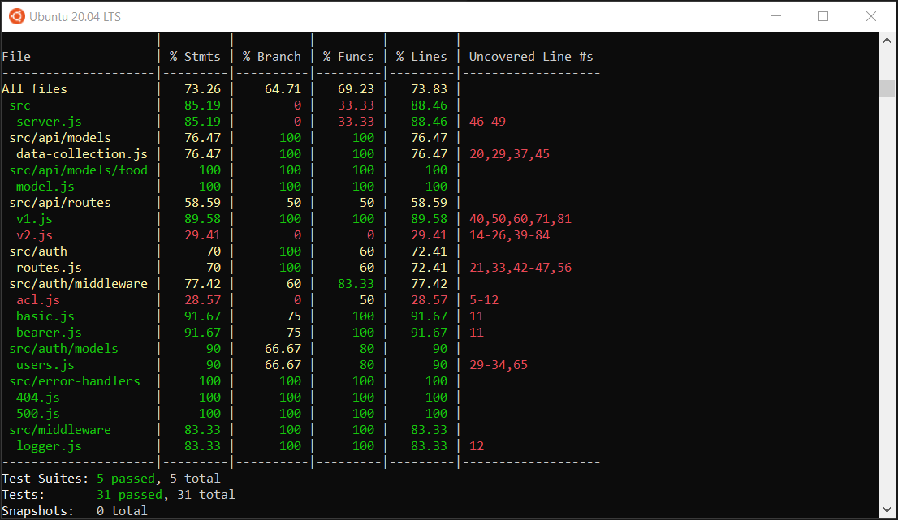
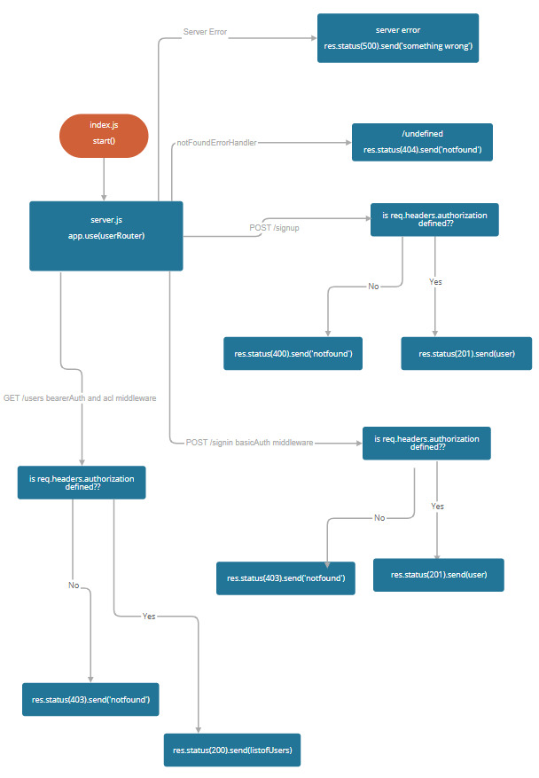
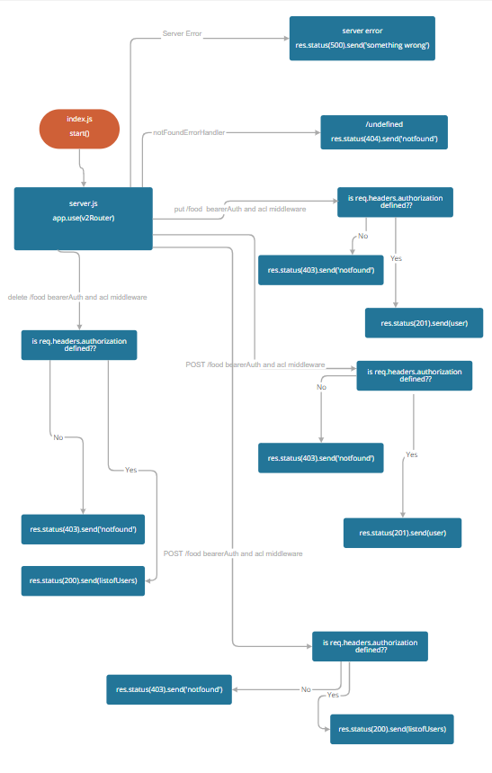
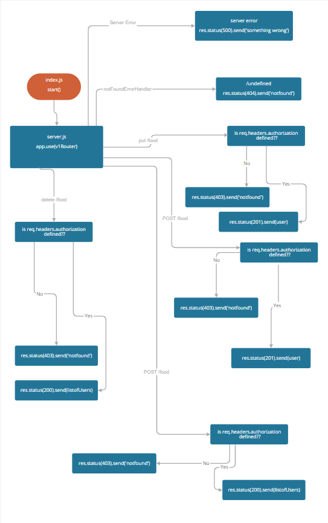

# auth-api

[heroku](https://khamees-auth-api.herokuapp.com/api)

[PR](https://github.com/mohammed-khamees/auth-api/pull/1)

[tests report](https://github.com/mohammed-khamees/auth-api/actions)

## how to work with this repo:

1. `npm init -y`
2. `npm i express dotenv cors morgan mongoose bcrypt base-64 jsonwebtoken method-override eslint`
3. `npm i -D jest @code-fellows/supergoose supertest`

- create .env file and added :
  - PORT=3000
  - MONGODB_URI=<% your mongo uri %>
  - SECRET=<% your json web token secret key %>

## Run the code:

- npm start
- Endpoints:

  - Auth:

    - POST /signin return the auth user
    - POST /signup return the new user
    - GET /users return list of the users in the mongodb
    - GET /secret return "Welcome to the secret area!"

  - API:

    - `/api/v1:`
      - GET /api/v1/:model return the models
      - GET /api/v1/:model/:id return a specific element in the model
      - POST /api/v1/:model create new element in the model
      - PUT /api/v1/:model/:id update a specific element in the model
      - DELETE /api/v1/:model/:id delete a specific element in the model
    - `/api/v2:`
      - GET /api/v2/:model return the models
      - GET /api/v2/:model/:id return a specific element in the model
      - POST /api/v2/:model create new element in the model
      - PUT /api/v2/:model/:id update a specific element in the model
      - PATCH /api/v2/:model/:id update a specific element in the model
      - DELETE /api/v2/:model/:id delete a specific element in the model

**On the `package.json` change the `script` to**

```
"scripts": {
    "start": "node index.js",
    "watch": "nodemon index.js",
    "test-watch": "jest --watchAll",
    "test": "jest"
  },

```



 => authRouter
 => v2Api
 => v2Api
